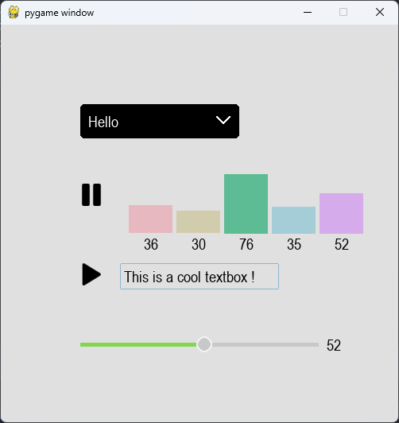

<br/>
<p align="center">
  <a href="https://github.com/Times0/PygameUIKit">
    
  </a>

  <h3 align="center">ReadME Generator</h3>

  <p align="center">
    An Awesome Pygame UI Kit to jumpstart your pygame projects !
    <br/>
    <br/>
  </p>
</p>

   
[](https://github.com/Times0/PygameUIKit/actions/workflows/publish-to-pypi.yml)
## About The Project



Description...

## Built With

Pygame

## Getting Started

```sh
pip install PygameUIKit
```

## Contributing

Feel free to contribute :)

### Creating A Pull Request

1. Fork the Project
2. Create your Feature Branch (`git checkout -b feature/AmazingFeature`)
3. Commit your Changes (`git commit -m 'Add some AmazingFeature'`)
4. Push to the Branch (`git push origin feature/AmazingFeature`)
5. Open a Pull Request

## License

Distributed under the MIT License. See [LICENSE](https://github.com/Times0/PygameUIKit/blob/main/LICENSE.md) for more information.

## Authors

